# MasterMind - projekt z przedmiotu **Technologie Obiektowe**

### Zespół **Kwadratowe Kafelki**: Michał Siedlanowski, Marcin Malcher, Maciej Kazalski, Piotr Makarewicz

## 1. Cel projektu

Celem projektu jest stworzenie cyfrowej wersji gry MasterMind. Implementacja zostanie oparta o wzorzec
Model-View-Controller.

## 2. Model danych w bazie

### 2.1. Diagram tabel w bazie

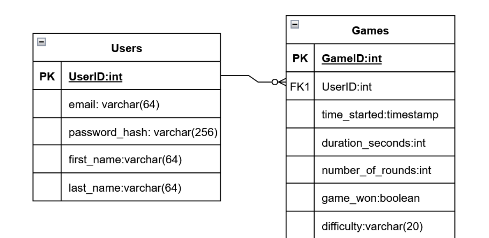

### 2.2  Przykładowe wartości w tabeli Users

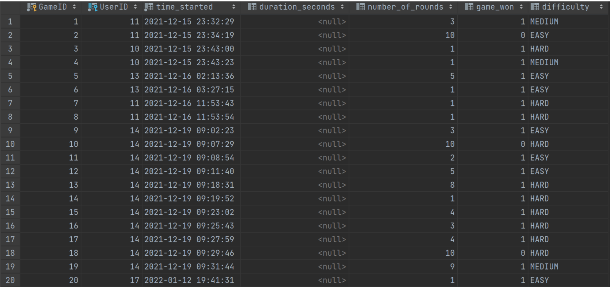

### 2.3. Przykładowe wartości tabeli Games

## 3. Model we wzorcu MVC

### 3.1. Pakiet model.dao

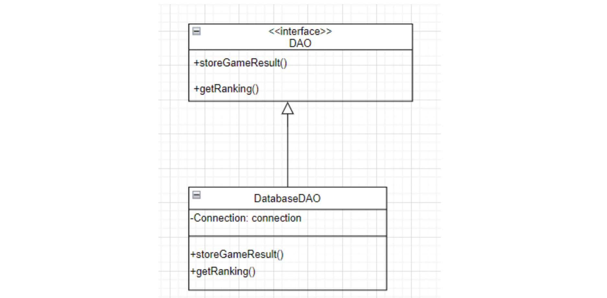

### 3.2. Pakiet model.game

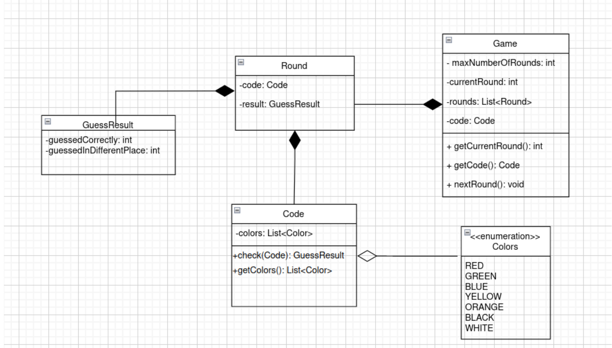

### 3.3. Pakiet model.user

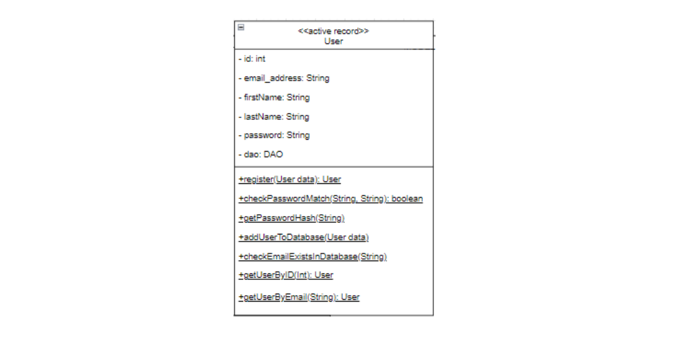

### 3.4. Pakiet model.session

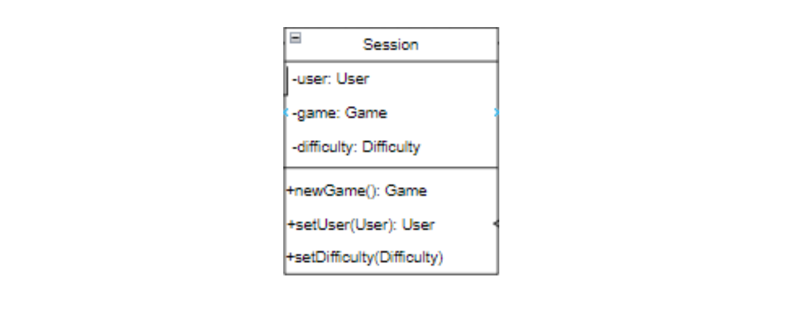

##4. Kontrolery razem z widokami

### 4.1. BoardController

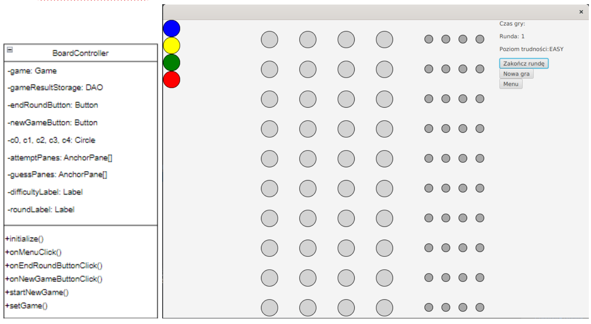

### 4.2. LoginController

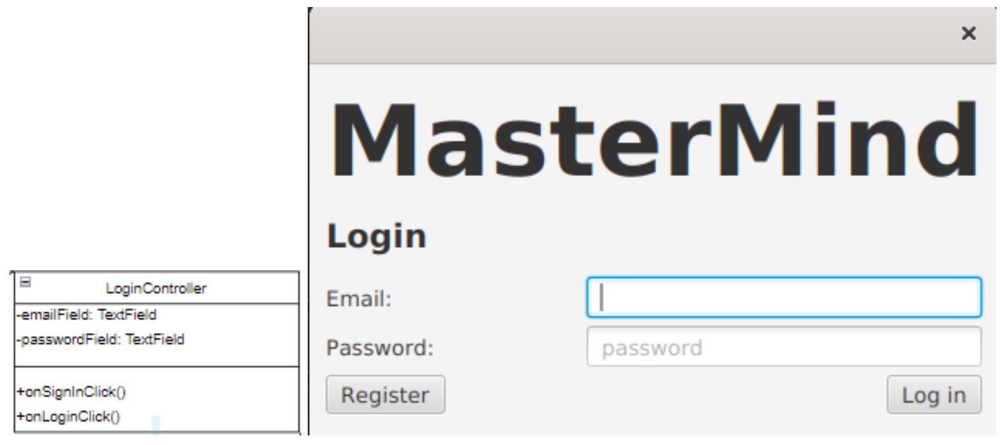

### 4.3. RegistrationController

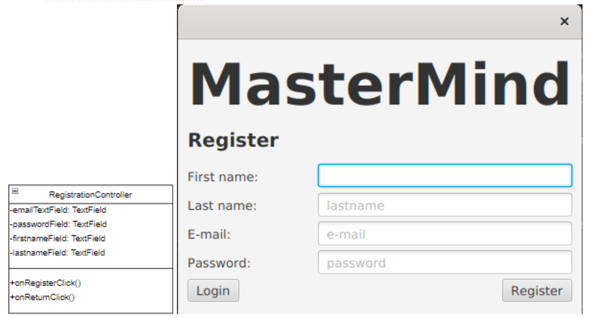

### 4.4. MenuController

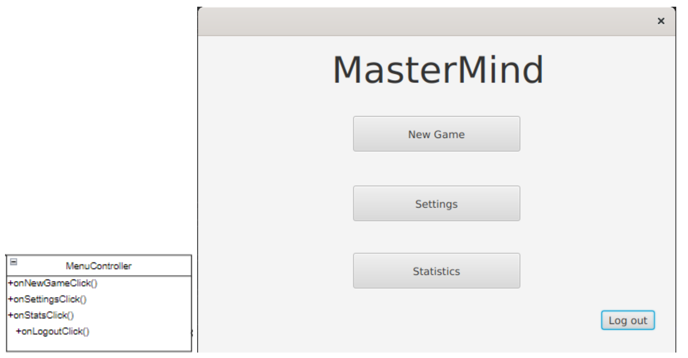

### 4.5. SettingsController

### 4.6. StatsContoller

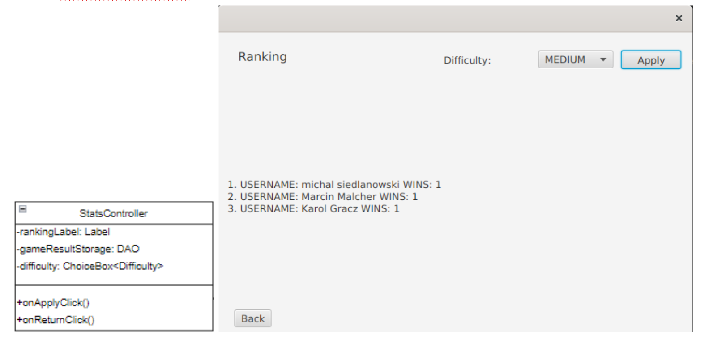

## 5. Pakiet controller

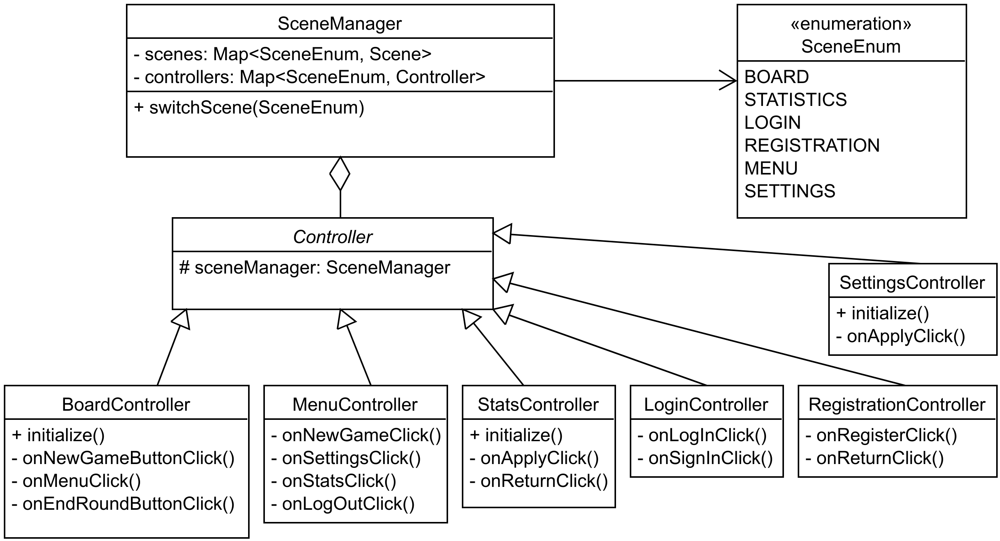
